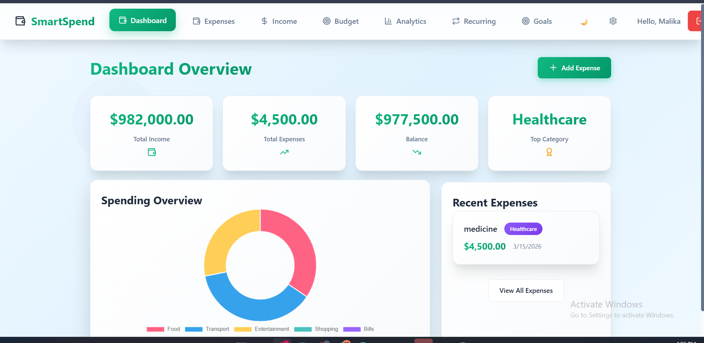
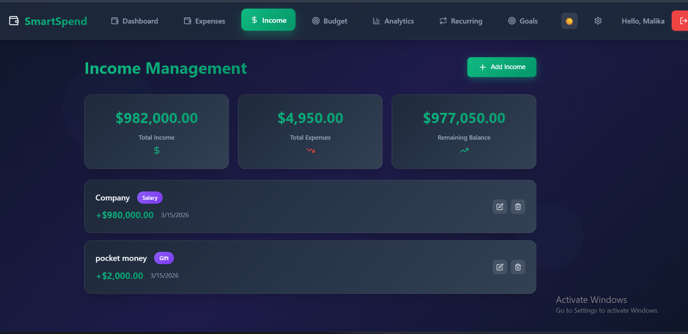
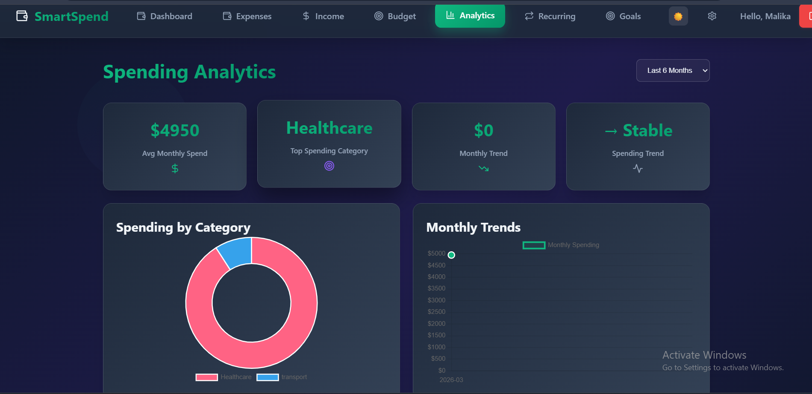
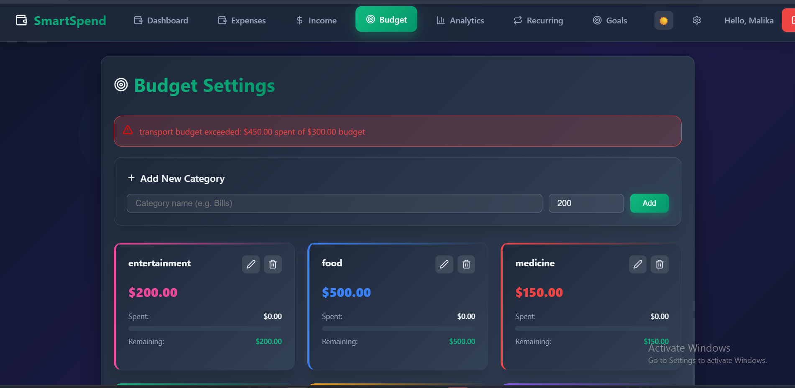
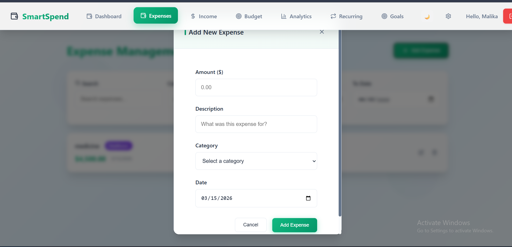

# SmartSpend – Personal Expense Tracker

  
<!-- Replace the placeholder image above with a real screenshot of your app dashboard -->

**SmartSpend** is a full-stack personal finance web application that helps users track income, expenses, set budgets, and gain insights into their spending habits. Built with a modern tech stack, it includes secure user authentication (with forgot password functionality), real-time data updates, and a clean, responsive user interface.

##  Features

- **User Authentication**  
  - Secure registration & login (JWT)  
  - Forgot password with reset link (email in production / token in dev)  
  - Password hashing with bcrypt  

- **Expense & Income Management**  
  - Add, edit, delete transactions  
  - Categorize expenses (Food, Transport, Bills, etc.)  
  - Support for both income and expense entries  

- **Dashboard & Analytics**  
  - Real-time balance overview  
  - Monthly / category-wise spending summaries  
  - Visual charts (pie, bar – using Chart.js / Recharts)  

- **Responsive Design**  
  - Works beautifully on desktop, tablet, and mobile  

- **Additional**  
  - Environment-based configuration (.env)  
  - Input validation & error handling  
  - Toast notifications for user feedback  

##  Tech Stack

| Layer       | Technology                  | Purpose                              |
|-------------|-----------------------------|--------------------------------------|
| Frontend    | React.js (Vite / CRA)       | UI & client-side logic               |
| Backend     | Node.js + Express.js        | API server & business logic          |
| Database    | MongoDB (Mongoose)          | Data storage                         |
| Auth        | JWT, bcrypt                 | Secure authentication                |
| Email       | Nodemailer (Mailtrap/SendGrid in prod) | Password reset emails     |
| Styling     | Tailwind CSS / CSS / Material UI | Modern & responsive UI     |
| Charts      | Chart.js / Recharts         | Data visualization                   |
| State Mgmt  | Context API / Redux Toolkit | (depending on your implementation)   |

## Quick Start (Local Development)

### Prerequisites

- Node.js ≥ 18
- npm / yarn / pnpm
- MongoDB (local or MongoDB Atlas)
- (Optional) Mailtrap / SendGrid account for email testing

### 1. Clone the repository

```bash
git clone https://github.com/your-username/smartspend.git
cd smartspend
Install dependencies
Bash# Backend
cd backend
npm install

#Frontend (in another terminal or new tab)
cd ../frontend
npm install
3. Set up environment variables
Create .env files in both backend/ and frontend/ (if needed).
backend/.env example:
textPORT=5000
MONGO_URI=mongodb://localhost:27017/smartspend
JWT_SECRET=your_very_long_random_secret_here
NODE_ENV=development
CLIENT_URL=http://localhost:5173
MAIL_HOST=smtp.mailtrap.io
MAIL_PORT=2525
MAIL_USER=xxxxxxxxxxxxxx
MAIL_PASS=xxxxxxxxxxxxxx
frontend/.env (Vite uses .env):
textVITE_API_URL=http://localhost:5000/api
4. Run the app
Bash# Backend (from backend folder)
npm run dev    # or npm start
# Backend (from backend folder)
npm run dev    # or npm start

# Frontend (from frontend folder)
npm run dev
Open http://localhost:5173 (or your Vite port) in the browser.
📸 Screenshots
### SignUp page Screen

### Login Screen

### Dashboard
The dashboard shows your current balance, expense summary, and charts.

### Expense Screen

### Income Screen

### Add Expense Screen

### Analytics Screen

### Budget Screen

### Profile Setting  page Screen

### DarkTheme Dashboard Screen

###Recurring Screen

###Goals Screen


🗂 Project Structure
textsmartspend/
├── backend/                # Node.js + Express API
│   ├── config/             # DB connection, etc.
│   ├── controllers/        # Business logic (auth, expenses, etc.)
│   ├── models/             # Mongoose schemas
│   ├── routes/             # API endpoints
│   ├── middleware/         # Auth protection
│   └── server.js / index.js
├── frontend/               # React app
│   ├── src/
│   │   ├── components/
│   │   ├── pages/          # Login, Register, Dashboard, etc.
│   │   ├── context/        # AuthContext, ExpenseContext...
│   │   ├── services/       # API calls (axios)
│   │   └── App.jsx
├── .gitignore
└── README.md
🔐 Security Notes

Never commit .env files
Use strong JWT_SECRET
In production: Use HTTPS, rate limiting, input sanitization, helmet, etc.

🚀 Deployment (Recommended Platforms)

Frontend: Vercel / Netlify
Backend: Render / Railway / Cyclic
Database: MongoDB Atlas
Domain: Namecheap / Cloudflare + free SSL

🤝 Contributing
Contributions are welcome!

Fork the repository
Create a feature branch (git checkout -b feature/amazing-feature)
Commit your changes (git commit -m 'Add some amazing feature')
Push to the branch (git push origin feature/amazing-feature)
Open a Pull Request

📄 License
This project is licensed under the MIT License – see the LICENSE file for details.
❤️ Acknowledgments

Inspired by everyday financial struggles
Thanks to the open-source community (React, Express, MongoDB, Nodemailer, etc.)

Made with 💜 by wania
Last updated: March 2025
Star ⭐ this repo if you find it helpful!


